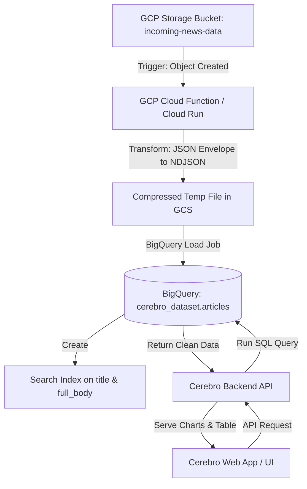

# Cerebro Data Engineering & Architecture Report

This report provides a detailed root-cause analysis of the performance and stability issues in the **Cerebro** analysis platform, evaluates database alternatives (specifically Google BigQuery, Elasticsearch, and PostgreSQL), and presents a production-grade implementation roadmap.

---

## 1. Root Cause Analysis: Why Your Current System Fails

Your current architecture stores data as a raw JSON file (11GB+) on a single GCP Virtual Machine (VM) and processes queries on-the-fly using custom analysis code. This approach hits three severe bottlenecks:

### A. Memory Exhaustion (Out-of-Memory / OOM Crashes)
* **The Problem:** In languages like Python or JavaScript, parsing a JSON file requires loading the entire string into memory and parsing it into an in-memory object tree. An 11GB JSON file easily expands to **30GB - 50GB of RAM** due to object wrappers, memory fragmentation, and language-specific data structures.
* **The Result:** If your VM has less than 64GB of RAM, the operating system's OOM killer will terminate your analysis script, leading to silent or loud execution crashes.

### B. Linear Scan Complexity ($O(N)$ Text Search)
* **The Problem:** Without a database index, searching for keywords requires scanning every single character of the `title` and `full_body` of all articles. 
* **The Math:** With 240,000+ historical articles, plus 50,000 new articles daily, your database will reach 5 million articles in a few months. Running regex or string containment checks (`keyword in full_body`) across millions of long articles takes minutes of pure CPU consumption per query.

### C. Write Amplification & Race Conditions
* **The Problem:** Adding 50k+ articles daily means you are appending to or rewriting a multi-gigabyte JSON file. If multiple requests or ingestion processes write to the file simultaneously, it leads to corruption. Furthermore, reading and writing to the same file blocks execution (I/O locking).

---

## 2. BigQuery Evaluation

**Yes, BigQuery is the ideal solution for your use case.** It is a serverless, highly scalable data warehouse designed exactly for analytical workloads (OLAP) on large datasets.

### Why BigQuery fits Cerebro perfectly:
1. **Serverless Scaling:** You don't manage VMs, RAM, or disk space. BigQuery scales compute resources dynamically for each query.
2. **Native JSON & NDJSON Loading:** BigQuery can ingest compressed `.gz` files directly, saving network bandwidth and ingestion costs.
3. **Partitioning & Clustering:** You can partition tables by date (`published_at`) and cluster by publication name (`agency`) and `sector`. When a user searches a specific date range, BigQuery **only scans the data in that range**, reducing scan costs to near-zero.
4. **Search Indexes (FTS):** BigQuery supports Search Indexes. By indexing `title` and `full_body`, keyword searches bypass full column scans, delivering sub-second search times.
5. **SQL Power:** Complex metrics (sentiment breakdown, publication bar charts, keyword counts) are executed in parallel on Google's Jupiter network in milliseconds using standard SQL.
6. **Extremely Low Cost:** 
   * **Storage:** $0.02 per GB per month. An 11GB database costs **$0.22 per month**. Even at 500GB, it's only $10/month.
   * **Compute:** $5.00 per TB scanned (with 1TB free per month). Because you will partition and index your data, typical queries will scan less than 50MB, meaning your queries will run virtually for **free** within the free tier.

---

## 3. Alternative Approaches: Comparison

If you want to look beyond BigQuery, here are the other two viable architectures:

| Criteria | BigQuery (Recommended) | Elasticsearch / OpenSearch | PostgreSQL (with Full-Text Index) |
| :--- | :--- | :--- | :--- |
| **Primary Use Case** | Large-scale analytics, aggregations, SQL reporting. | Advanced search (fuzzy search, relevance ranking, autocomplete). | Relational app database with light search needs. |
| **Write/Ingestion Speed** | Extremely fast batch load (millions of rows in seconds). | Fast, but heavy index building uses significant CPU. | Slows down as text/GIN indexes grow. |
| **Search Speed** | **Sub-second** (with Search Indexes & Partitioning). | **Instant (< 100ms)** (Dedicated inverted index). | **Slow-to-Medium** (Requires substantial RAM to cache indexes). |
| **Aggregation Speed** | **Instant** (Parallel SQL execution engine). | **Instant** (In-memory bucket aggregations). | **Slow** (Sequential scans for complex group-bys). |
| **Maintenance Burden** | **Zero** (Fully managed serverless). | **High** (Need to manage JVM memory, clusters, disks). | **Medium** (Need to tune autovacuum, RAM, and index sizes). |
| **Cost Scale** | Pay-per-query (virtually free at your scale). | High baseline cost ($50–$200/mo minimum for VM instance). | Medium baseline cost (cost of the VM/Cloud SQL instance). |

### Summary of Alternatives:
* **Choose Elasticsearch** *only* if your users need advanced search features like fuzzy matching (e.g., matching "Kosp" to "Kospi"), spelling corrections, or complex keyword relevance scoring.
* **Choose PostgreSQL** *only* if you want to keep everything in a single relational database and do not mind maintaining the VM sizing, disk capacity, and index tuning yourself.
* **Choose BigQuery** for ease of use, zero-maintenance, top-tier SQL aggregation capabilities, and direct GCP ecosystem integration.

---

## 4. Production-Grade Architecture with BigQuery

Here is the blueprint for a robust, automated, and high-performance ingestion and querying system.



### Step 1: BigQuery Schema Design

To maximize performance and minimize cost, define the table with:
* **Partitioning:** By Day on the `published_at` timestamp.
* **Clustering:** By `agency` (for publication aggregations) and `sector` (for sector filtering).

```sql
CREATE OR REPLACE TABLE cerebro_dataset.articles (
  id INT64,
  title STRING,
  url STRING,
  full_body STRING,
  author STRING,
  agency STRING,
  published_at TIMESTAMP,
  sector STRING,
  region STRING,
  summary STRING,
  sentiment STRING,
  word_count INT64,
  scraped_at TIMESTAMP
)
PARTITION BY DATE(published_at)
CLUSTER BY agency, sector;
```

### Step 2: Creating the Search Index
Run this SQL command once the table is created to index the text columns:

```sql
CREATE SEARCH INDEX articles_search_idx 
ON cerebro_dataset.articles(title, full_body);
```

---

## 5. Ingestion Pipeline Implementation (Daily 50k+ Articles)

Because your input format is a wrapped JSON envelope (`{ "total": ..., "articles": [...] }`), you **cannot** load it directly into BigQuery. BigQuery expects **Newline-Delimited JSON (NDJSON)**, where each line is a single flat JSON record like this:
```json
{"id": 453442, "title": "South Korea's...", "agency": "India Today", ...}
{"id": 453443, "title": "Another article...", "agency": "BBC", ...}
```

### Python Lambda / Cloud Function for Automated Ingestion
This script runs in a Cloud Function, triggered whenever a new `.gz` file is uploaded to your Google Cloud Storage bucket. It extracts the articles, converts them to NDJSON, and loads them into BigQuery.

```python
import json
import gzip
import io
from google.cloud import storage
from google.cloud import bigquery

def gcs_to_bigquery_trigger(event, context):
    """Triggered by a change to a Cloud Storage bucket."""
    bucket_name = event['bucket']
    file_name = event['name']
    
    # Only process .gz files
    if not file_name.endswith('.gz'):
        print(f"Skipping non-gzip file: {file_name}")
        return

    storage_client = storage.Client()
    bq_client = bigquery.Client()
    
    # 1. Read compressed source file from GCS
    bucket = storage_client.bucket(bucket_name)
    blob = bucket.blob(file_name)
    compressed_data = blob.download_as_bytes()
    
    # 2. Decompress and parse the JSON envelope
    with gzip.GzipFile(fileobj=io.BytesIO(compressed_data)) as gzip_file:
        raw_json = json.load(gzip_file)
        
    articles = raw_json.get("articles", [])
    if not articles:
        print("No articles found in JSON envelope.")
        return
        
    # 3. Convert articles to Newline-Delimited JSON (NDJSON) string
    ndjson_buffer = io.StringIO()
    for article in articles:
        # Map fields to match BigQuery schema
        record = {
            "id": article.get("id"),
            "title": article.get("title"),
            "url": article.get("url"),
            "full_body": article.get("full_body"),
            "author": article.get("author"),
            "agency": article.get("agency"),
            # Parse timestamp to ISO format for BigQuery
            "published_at": article.get("published_at"),
            "sector": article.get("sector"),
            "region": article.get("region"),
            "summary": article.get("summary"),
            "sentiment": article.get("sentiment"),
            "word_count": article.get("word_count"),
            "scraped_at": article.get("scraped_at")
        }
        ndjson_buffer.write(json.dumps(record) + "\n")
        
    ndjson_data = ndjson_buffer.getvalue().encode('utf-8')
    
    # 4. Load NDJSON directly into BigQuery
    dataset_id = "cerebro_dataset"
    table_id = "articles"
    table_ref = bq_client.dataset(dataset_id).table(table_id)
    
    job_config = bigquery.LoadJobConfig(
        source_format=bigquery.SourceFormat.NEWLINE_DELIMITED_JSON,
        write_disposition=bigquery.WriteDisposition.WRITE_APPEND, # Append daily data
        ignore_unknown_values=True
    )
    
    # Load from in-memory stream
    load_job = bq_client.load_table_from_file(
        io.BytesIO(ndjson_data),
        table_ref,
        job_config=job_config
    )
    
    print(f"Starting BigQuery load job for {file_name}...")
    load_job.result()  # Wait for the load job to complete
    print(f"Successfully loaded {len(articles)} articles into {dataset_id}.{table_id}.")
```

---

## 6. Querying and Analysis Implementation (Fast API SQL)

Here are the optimized SQL queries you will run from your Cerebro backend (Node.js/Python) to generate the analytics requested by your users.

### Query 1: Keyword Search & Metadata Count (Bulletproof)
This query searches for articles containing the keyword **"artificial intelligence"** in either the title or body within a specific date range. It uses the `SEARCH` index function, ensuring sub-second response times.

```sql
SELECT 
  COUNT(*) as total_occurrences,
  COUNT(DISTINCT agency) as unique_publications
FROM 
  `cerebro_dataset.articles`
WHERE 
  -- Partition filter (prunes cost and time)
  published_at BETWEEN '2026-06-01 00:00:00' AND '2026-06-30 23:59:59'
  -- Search Index utilization (extremely fast)
  AND SEARCH((title, full_body), 'artificial intelligence');
```

### Query 2: Publication-Wise Distribution (Bar Chart Data)
Get the publication breakdown to feed your bar charts:

```sql
SELECT 
  agency,
  COUNT(*) as article_count
FROM 
  `cerebro_dataset.articles`
WHERE 
  published_at BETWEEN '2026-06-01T00:00:00' AND '2026-06-30T23:59:59'
  AND SEARCH((title, full_body), 'artificial intelligence')
GROUP BY 
  agency
ORDER BY 
  article_count DESC
LIMIT 50;
```

### Query 3: Sentiment Segregation
Categorize matching articles based on sentiment categories (positive, neutral, negative):

```sql
SELECT 
  COALESCE(sentiment, 'Unclassified') as sentiment_group,
  COUNT(*) as count
FROM 
  `cerebro_dataset.articles`
WHERE 
  published_at BETWEEN '2026-06-01T00:00:00' AND '2026-06-30T23:59:59'
  AND SEARCH((title, full_body), 'artificial intelligence')
GROUP BY 
  sentiment_group;
```

### Query 4: Dropdown List of Articles (with Pagination)
Return a paginated list of matching articles to display in your UI dropdown/list:

```sql
SELECT 
  id,
  title,
  agency,
  published_at,
  sentiment,
  url
FROM 
  `cerebro_dataset.articles`
WHERE 
  published_at BETWEEN '2026-06-01T00:00:00' AND '2026-06-30T23:59:59'
  AND SEARCH((title, full_body), 'artificial intelligence')
ORDER BY 
  published_at DESC
LIMIT 100 OFFSET 0;
```

---

## 7. Migration Checklist

To move from your current crashing VM configuration to this bulletproof BigQuery pipeline, follow these steps:

1. **Set up BigQuery Dataset:**
   * Create a GCP project (or use your current `cerebro` project).
   * Create a BigQuery dataset named `cerebro_dataset`.
2. **Create the Table & Index:**
   * Run the SQL statements in **Section 4** to create the partitioned table and search index.
3. **Migrate Historical Data (Your 11GB+ JSON):**
   * Write a one-off local python script to read your massive JSON, transform it to NDJSON format in chunks (using a generator/stream so it doesn't crash your machine), compress it to `.gz`, and upload it to a GCS bucket.
   * Run a `bq load` command to populate the historical database.
4. **Deploy Daily Automation:**
   * Set up a GCS bucket for incoming `.gz` files.
   * Deploy the Python Cloud Function (detailed in **Section 5**) to listen to this bucket and automatically ingest files as they are uploaded.
5. **Update Cerebro App Backend:**
   * Install the `@google-cloud/bigquery` library in your backend.
   * Replace the local file-reading logic with the SQL queries from **Section 6**.
